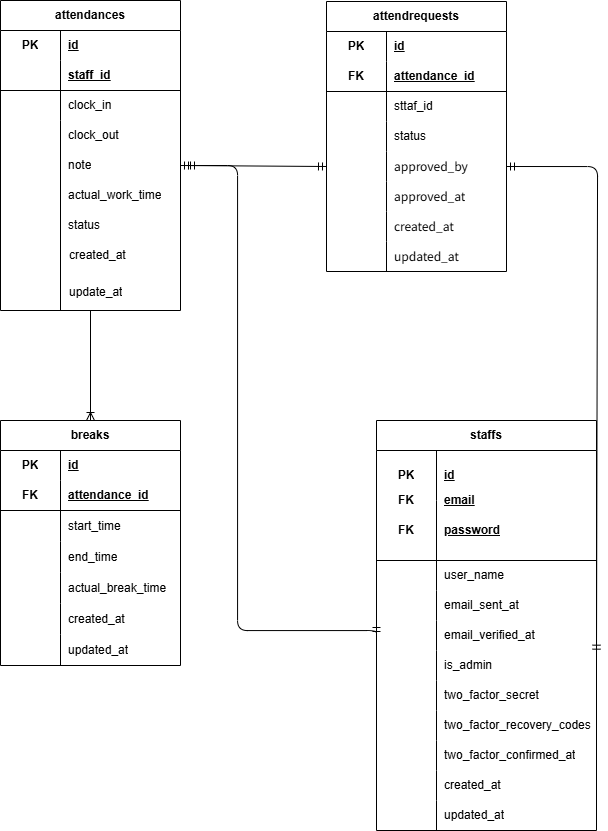

# _勤怠管理アプリケーションシステム_

## _概要_
  本アプリでは、出退勤・休憩記録のリアルタイム管理、月次集計の自動化、スタッフ一覧管理により
  正確性・業務効率化・記録の透明性を向上することを目的としている。

## _対象ユーザー_
  - 一般スタッフ：出勤・退勤・休憩記録 / 月別勤務照会 / プロフィール編集
  - 管理者：社員管理 / 勤怠管理 / 統計確認

## _機能一覧_
  - ログイン・認証: Fortifyによるログイン / 会員登録 / メール認証 /
  - 勤怠管理: 出勤・退勤ボタン / 休憩開始・終了 / 当日ステータス表示
  - 従業員管理:スタッフ一覧 / 詳細 / 編集 / 削除（管理者のみ）
  - セキュリティ: CSRF / 認可（Gate） / 管理者判定機能 / throttling
  - UI: レスポンシブデザイン（PC / タブレット / スマートフォン対応）

## _使用技術(実行環境)_
### バックエンド
    PHP 8 / Laravel 10 / Laravel Fortify
### フロントエンド
    Blade / HTML / CSS
### データベース
    MySQL 8 / Migration / Seeder / Factory
### ミドルウェア
    Nginx / Docker Compose
### 外部サービス
    Mailtrap（メール送信の検証）
### 開発ツール
    VSCode / Git / Laravel Artisan CLI / phpMyAdmin

## _環境構築_
    1.  リポジトリのクローン
        git clone https://github.com/bam600/Work_hours_system.git
        cd Work_hours_system
    2. Docker 起動
        docker-compose up -d --build
    3.  Laravelセットアップ
        docker-compose exec php bash
        composer install
        cp .env.example .env
        php artisan key:generate
        php artisan migrate
        php artisan db:seed
    ＊MySQLは、OSによって起動しない場合があるので、各PCにあわせて
    docker-compose.ymlファイルを編集してください。
    
## _認証設定（Fortify）_
    1.  docoker-compose exec php bash
    2.  composer require laravel/fortify
    3.  config/app.phpにApp\Providers\FortifyServiceProvider::class,を追加
    4.  php artisan vendor:publish --provider="Laravel\Fortify\FortifyServiceProvider"
    5.  App\Providers\FortifyServiceProvider.phpに
        Fortify::loginView(fn () => view('auth.login'));
        Fortify::registerView(fn () => view('auth.register'));を追加
        ＊必要に応じてルーティングやビューを調整

## _メール送信（Mailtrap）_
    本アプリでは、新規登録時の確認メール送信・パスワードリセットメール送信を行うために Mailtrap を使用
### Mailtrap アカウント作成
    1.  https://mailtrap.ioにアクセス
    2.  Sign up → 無料アカウント作成
    3.  Dashboard から Email Testing → Inboxes を開く
    4.  既存の Inbox を選択、または「Add Inbox」で新規作成
### MAIL_USERNAME / MAIL_PASSWORD の取得方法
    1.  Mailtrap ダッシュボードの Inbox 画面を開く
    2.  上部メニューから Integration を選択
    3.  「Integrate with」から Laravel 9+ / 10 を選択
    4.    画面中央に .env 形式の SMTP 設定コード が表示されます
          その中にある ⬇
          MAIL_USERNAME=xxxxxxxxxxxx
          MAIL_PASSWORD=xxxxxxxxxxxx
          この2つが Mailtrapが発行したメール認証情報です。
          (コピーのボタンでコピーしないと情報が得られません)
### .envに以下を設定
    MAIL_MAILER=smtp
    MAIL_HOST=smtp.mailtrap.io
    MAIL_PORT=2525
    MAIL_USERNAME=xxxxxxxxxxx
    MAIL_PASSWORD=xxxxxxxxxxx
    MAIL_ENCRYPTION=null
    MAIL_FROM_ADDRESS=info@example.com
    MAIL_FROM_NAME="${APP_NAME}"

## _Livewireの導入_
    composer require livewire/livewire

## _URL一覧_
    - トップページ：`http://localhost:8000` 
    - ログイン：`http://localhost/login`  
    - 登録：`http://localhost/register`
    - 管理者ユーザ用ログイン：`http://localhost/admin/login`  

## _テストユーザー（Seederで自動作成）_
    http://localhost:8080/にアクセス
    Seederで自動作成後staffsテーブルを開く
    管理者でのログインする場合はis_adminカラムが1のユーザーの
    メールアドレスを選択
    パスワードは00000000でログイン
    一般ユーザでログインする場合はis_adminカラムが0のユーザーの
    メールアドレスを選択
    パスワードは00000000でログイン

## _ER 図_
